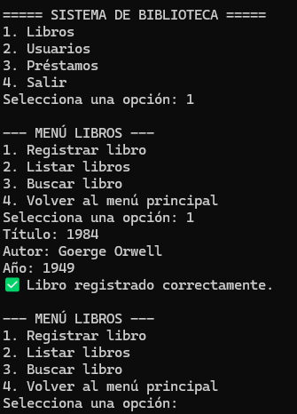

# Sistema de Biblioteca — Proyecto en Python con MySQL

## Descripción general  

**Este proyecto implementa un sistema de gestión de biblioteca completamente funcional desde la terminal, desarrollado en Python bajo un enfoque orientado a objetos (POO).
Permite administrar libros, usuarios y préstamos mediante menús interactivos, con conexión a MySQL, manejo de logs y una arquitectura modular, clara y escalable.**

**El propósito del sistema es simular un entorno real de gestión bibliotecaria, integrando prácticas seguras y profesionales de programación, como:**

- Consultas parametrizadas (para evitar inyección SQL).

- Validación de entradas del usuario.


- Registros de actividad (logs).

- Control de disponibilidad de libros y préstamos activos.

---


## Características Principales
- **Arquitectura modular y orientada a objetos**

Cada componente (libros, usuarios, préstamos, conexión, logs, menú) está encapsulado en su propia clase.

- **Interfaz de terminal intuitiva**

El usuario puede navegar entre menús mediante opciones numéricas.
- **Persistencia en base de datos MySQL**

Todos los datos se almacenan y gestionan mediante consultas SQL seguras.
- **Sistema de logs y manejo de errores**

Registra cada acción importante (alta, baja, error de conexión, excepciones) para depuración y trazabilidad.

- **Fácil mantenimiento y expansión**

Diseñado para permitir agregar fácilmente nuevas funciones o entidades (por ejemplo, “autores” o “categorías”).

---


## Instalación y Configuración
 ### 1. Requisitos previos
#### Asegúrate de tener instalado:

- Python 3.10 o superior

- MySQL Server

- pip (gestor de paquetes de Python)

#### 2. Clonar el repositorio

```
git clone https://github.com/EnriqueSoto300/sistema-biblioteca.git
cd sistema-biblioteca


```
#### 3. Crear base de datos

**Ejecuta en MySQL Workbench** 

```
CREATE DATABASE biblioteca;
USE biblioteca;

CREATE TABLE libros (
    id INT AUTO_INCREMENT PRIMARY KEY,
    titulo VARCHAR(100),
    autor VARCHAR(100),
    anio INT,
    disponible BOOLEAN
);

CREATE TABLE usuarios (
    id INT AUTO_INCREMENT PRIMARY KEY,
    nombre VARCHAR(100),
    tipo VARCHAR(50)
);

CREATE TABLE prestamos (
    id INT AUTO_INCREMENT PRIMARY KEY,
    id_usuario INT,
    id_libro INT,
    fecha_prestamo DATE,
    fecha_devolucion DATE,
    FOREIGN KEY (id_usuario) REFERENCES usuarios(id),
    FOREIGN KEY (id_libro) REFERENCES libros(id)
);


```
#### 4. Instalar dependencias
```
pip install mysql-connector-python

```
### Ejecución del programa
```
python biblioteca.py

```
### Verás un menú interactivo como el siguiente:

```
=== Sistema de Biblioteca ===
1. Gestionar Libros
2. Gestionar Usuarios
3. Gestionar Préstamos
4. Salir
Seleccione una opción:

```

Cada submenú te permitirá agregar, listar, editar o eliminar registros según corresponda.

---

## Diseño Orientado a Objetos

### El sistema sigue principios de POO:

- Encapsulación:

Cada entidad (Libro, Usuario, Prestamo) tiene sus propios atributos y métodos.

- 

- Abstracción:

Se separan las responsabilidades en clases especializadas (DatabaseConnection, LoggerService, Menu).

- Herencia y composición: 

Las clases colaboran a través de composición para evitar duplicación de código.

- Responsabilidad única (SRP):

Cada módulo tiene un propósito claro, mejorando la mantenibilidad.

---

## Ejemplo de Registro en Logs
#### Cada acción relevante se registra automáticamente en logs/app.log, por ejemplo:


```
[2025-10-12 13:42:07] INFO: Libro "El Quijote" agregado correctamente.
[2025-10-12 13:43:15] ERROR: Error de conexión con la base de datos.
[2025-10-12 13:45:01] INFO: Usuario "María López" eliminado.

```
---

## Mejoras respecto al código original

| **Aspecto** | **Código original** | **Versión mejorada** |
|--------------|---------------------|----------------------|
| **Interfaz** | Interacción básica con `input()` y `print()` | Menús estructurados y navegación interactiva por consola |
| **Validaciones** | No validaba entradas ni errores comunes | Se validan campos vacíos, IDs inválidos y disponibilidad de libros |
| **Consultas SQL** | Usaba consultas sin parámetros | Implementación de **consultas parametrizadas** para evitar inyecciones SQL |
| **Registro de acciones (Logs)** | No existía registro de eventos | Sistema de **logs** que guarda operaciones y errores en `logs.txt` |
| **Gestión de préstamos** | No verificaba disponibilidad | Comprueba disponibilidad del libro y existencia del usuario antes de registrar el préstamo |
| **Devolución de libros** | No implementado completamente | Opción para **devolver libros** y marcar como disponibles nuevamente |
| **Mensajes al usuario** | Salidas genéricas y poco descriptivas | Mensajes claros y diferenciados por tipo (éxito, error, información) |
| **Estructura del código** | Código monolítico sin separación lógica | Modularización: clases, conexión y funciones separadas para mayor mantenimiento |


---
## Interfaz  por terminal 



## Autor
### Enrique Soto


