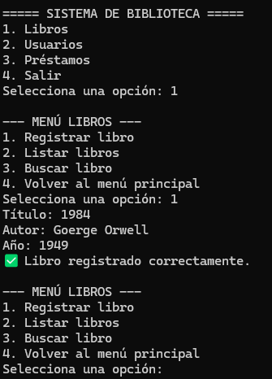

# Sistema de Biblioteca — Python + MySQL

Proyecto académico desarrollado en **Python** con conexión a una base de datos **MySQL**.  
Permite gestionar libros, usuarios y préstamos desde una **interfaz por terminal interactiva**, validando datos, mostrando mensajes claros y registrando operaciones en logs.

---

## Descripción general

El sistema fue creado para simular la gestión de una biblioteca, donde se pueden:

- Registrar, listar y buscar **libros**.
- Registrar, listar y buscar **usuarios**.
- Registrar y devolver **préstamos de libros**.
- Consultar préstamos **activos**.
- Controlar automáticamente la **disponibilidad de los libros**.
- Registrar las operaciones y errores en un **archivo de log**.
- Usar consultas **parametrizadas** para prevenir inyecciones SQL.

El programa utiliza una interfaz de **menús por consola**, que permite navegar entre las diferentes secciones de forma clara y ordenada.


---

## Tecnologías utilizadas

- **Python 3.10+**
- **MySQL Server**
- **mysql-connector-python** (para la conexión con la base de datos)
- **datetime**, **os**, y **logging** (para manejo de fechas y registros)

---

## Requisitos

Antes de ejecutar el proyecto, asegúrate de tener instalado:

```bash
sudo apt update
sudo apt install python3 python3-pip mysql-server
pip install mysql-connector-python
```

## Crea la base de datos y las tablas necesarias:

```bash
CREATE DATABASE biblioteca;
USE biblioteca;

CREATE TABLE libros (
    id INT AUTO_INCREMENT PRIMARY KEY,
    titulo VARCHAR(100),
    autor VARCHAR(100),
    isbn VARCHAR(30),
    editorial VARCHAR(50),
    disponible BOOLEAN DEFAULT 1
);

CREATE TABLE usuarios (
    id INT AUTO_INCREMENT PRIMARY KEY,
    nombre VARCHAR(100),
    correo VARCHAR(100)
);

CREATE TABLE prestamos (
    id INT AUTO_INCREMENT PRIMARY KEY,
    id_usuario INT,
    id_libro INT,
    fecha_prestamo DATETIME,
    fecha_devolucion DATETIME NULL,
    FOREIGN KEY (id_usuario) REFERENCES usuarios(id),
    FOREIGN KEY (id_libro) REFERENCES libros(id)
);
```

## Configura las credenciales de conexión en biblioteca.py:

```bash
self.conexion = mysql.connector.connect(
    host="127.0.0.1",
    user="root",
    password="tu_contraseña",
    database="biblioteca"
)
```

## Uso del programa

**Ejecuta el sistema desde la terminal:**

```bash
python3 biblioteca.py
```

## Aparecerá un menú principal con opciones:

```
===== SISTEMA DE BIBLIOTECA =====
1. Menú de Libros
2. Menú de Usuarios
3. Menú de Préstamos
4. Salir
```
**Cada menú incluye acciones como:**

- Registrar (añadir nuevo libro/usuario/préstamo)

- Listar (mostrar todos los registros)

- Buscar (consultar por nombre o ID)

- Devolver libro (marcar préstamo como devuelto)

- Consultar préstamos activos

## Mejoras respecto al código original

| **Aspecto** | **Código original** | **Versión mejorada** |
|--------------|---------------------|----------------------|
| **Interfaz** | Interacción básica con `input()` y `print()` | Menús estructurados y navegación interactiva por consola |
| **Validaciones** | No validaba entradas ni errores comunes | Se validan campos vacíos, IDs inválidos y disponibilidad de libros |
| **Consultas SQL** | Usaba consultas sin parámetros | Implementación de **consultas parametrizadas** para evitar inyecciones SQL |
| **Registro de acciones (Logs)** | No existía registro de eventos | Sistema de **logs** que guarda operaciones y errores en `logs.txt` |
| **Gestión de préstamos** | No verificaba disponibilidad | Comprueba disponibilidad del libro y existencia del usuario antes de registrar el préstamo |
| **Devolución de libros** | No implementado completamente | Opción para **devolver libros** y marcar como disponibles nuevamente |
| **Mensajes al usuario** | Salidas genéricas y poco descriptivas | Mensajes claros y diferenciados por tipo (éxito, error, información) |
| **Estructura del código** | Código monolítico sin separación lógica | Modularización: clases, conexión y funciones separadas para mayor mantenimiento |


## Ejemplo de registro en logs.txt

```
[2025-10-09 14:32:01] INFO: Libro 'Historia del tiempo' registrado con éxito.
[2025-10-09 14:35:17] ERROR: Error al registrar préstamo - Usuario no encontrado.
[2025-10-09 14:40:12] INFO: Libro ID=3 devuelto correctamente.
```

## Ejemplo de ejecución de la interfaz por terminal:





## Autor

**Enrique Soto**

